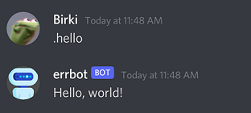

<h2 align="center"></h1>

<!--
<div>Icons made by <a href="https://www.freepik.com" title="Freepik">Freepik</a> from <a href="https://www.flaticon.com/" title="Flaticon">www.flaticon.com</a></div>
-->

<h2 align="center">errbot</h1>
<p align="center">
  A chatbot that is easy to deploy and build upon - It can do literally anything
</p>

<p align="center">
  <a href="https://github.com/GrantBirki/errbot/actions/workflows/deploy-ci.yml"></a>
  <a href="https://github.com/GrantBirki/errbot/actions/workflows/review.yml"></a>
  <a href="https://github.com/GrantBirki/errbot/actions/workflows/tfsec.yml"></a>
</p>

<p align="center">
  
  
  
  
</p>

<p align="center">
  
  
  
</p>

<hr>

## Bot Invite Link 🔗

[**Click here**](https://discord.com/api/oauth2/authorize?client_id=943402285680189511&permissions=36734976&scope=bot) to invite errbot to your Discord server!

## About 💡

This project uses [errbot](https://github.com/errbotio/errbot) (hence the name) and [Docker](https://www.docker.com/) to quickly launch your own chatbot in a container which is highly extensible! Use this dockerized version of Errbot to self-host your very own chatbot for popular services like Slack / Discord. Anything you can write Python 🐍 code to do, you can do with Errbot!

There are two ways you can use this bot:

1. Invite the bot to your own Discord server - You can even contribute to this repo to add your own commands!
2. Self-host the bot yourself to build upon it

> Check out [errbot-launchpad](https://github.com/GrantBirki/errbot-launchpad) if you don't want all the bells and whistles of this project.

## Quickstart ⭐

Want to get going quick? Run the following commands to bring up a CLI to interact with `errbot` locally:

1. `git clone git@github.com:GrantBirki/errbot.git`
2. `cd errbot`
3. `make local`

Didn't work quite right? Want to actually connect to a chat service? Check out the [docs](https://errbot.birki.io)

> Want to jump to the `Turbo Quickstart` for Discord guide? Check it out [here](https://errbot.birki.io/discord-turbo-quickstart/)

## Demo 📹

Check out the video below to see a simple example of errbot in action!

https://user-images.githubusercontent.com/23362539/154757128-82c3d546-2195-42ab-83ed-bcec63739f5e.mp4

## Writing Plugins 🧰

Writing and creating your own plugins is extremely easy! The snippet below shows you how to create your own chatbot function in just a few lines of code:

```python

from errbot import BotPlugin, botcmd

class Hello(BotPlugin):
    """Example 'Hello, world!' plugin for Errbot"""

    @botcmd
    def hello(self, msg, args):
        """Return the phrase "Hello, world!" in chat"""
        return "Hello, world!"
```

> Tip: Running `make command` from the root of this repo will give you some prompts to follow and will drop the above snippet in the correct folder

The result of the plugin code above is a new chatop command:



To learn more about plugin development, please check out the [development guide](https://errbot.birki.io/development)!

### Deployment and Hosting 🚀

If you do not wish to use this public version of errbot, you can clone this repo and self-host it anywhere you wish (yay opensource!).

This project builds a Docker container which you can deploy anywhere to bring your chatbot to life. Below are just a few example of all the many places you could deploy your chatbot container:

- Raspberry Pi
- Your own desktop
- Any virtual machine running Docker
- Public cloud container instances: ECS / Cloud Run / ACI
- Public cloud Kubernetes services: EKS / GKE / **AKS** ⭐

You may have noticed a "star" next to the **AKS** option. This is because it is the method I use to host my own instance of this project.

I have committed all my Terraform files which create and deploy my Azure Kubernetes Service (AKS) to this repo for reference. You will even notice GitHub actions running my pipeline publically for deployments. Feel free to use what I do as a guide, adapt it, and even improve upon it!

> Note: It is entirely up to you how you build, host, and deploy your container. There are tons of options and everyone has their own preferences.

For more details on deployment, you can check out my notes in the [deployment guide](https://errbot.birki.io/deployment)

### Community Discord 💬

If you need help with development, have a question, new feature, or just want to test out the bot, you can join the [errbot community Discord](https://discord.gg/qvnxqyuVpM)

### Documentation 📖

All the documentation for this project is available at [errbot.birki.io](https://errbot.birki.io).

You can also view the docs by browsing to the `docs/` directory in the root of this repository.

- [About](https://errbot.birki.io)
- [Setup](https://errbot.birki.io/setup)
- [Development](https://errbot.birki.io/development)
- [Commands](https://errbot.birki.io/commands)

---

### FAQ 📚

Expand the sections below to view commonly asked questions and their answers:

<details>
<summary>How can I contribute to the bot?</summary>

Check out the [contributing guide](CONTRIBUTING.md)!

</details>

<details>
<summary>How can I add my own command to the bot?</summary>

Check out the [contributing guide](CONTRIBUTING.md)!

</details>

<details>
<summary>How can I get real time help?</summary>

Check out the community Discord server link mentioned above in this document

</details>

<details>
<summary>Is this bot opensource?</summary>

Yes! If you are reading this text that means you have landed on the errbot repo where all the code and project files are located.

Everything and I mean _everything_ is open source about this bot.

Feel free to open pull requests to make your own changes and they will be live anywhere and everywhere where the bot lives in Discord.

</details>

<details>
<summary>How do I self-host my own version of this bot?</summary>

This is covered in the public documentation: [errbot.birki.io](https://errbot.birki.io)

</details>

<details>
<summary>How is this bot different from errbotio/errbot?</summary>

[errbotio/errbot](https://github.com/errbotio/errbot) is a fantastic chatbot framework written in Python and it is the foundation of this project.

This project uses [errbotio/errbot](https://github.com/errbotio/errbot) for all of its chatbot related function calls, communicating with the Discord backend, and the majority of its configuration.

There are some differences between the two, however:

- This project adapts some custom code that errbotio/errbot does not currently support. This includes things like custom logging, banning users/servers, locking certain commands, etc
- The original framework of [errbotio/errbot](https://github.com/errbotio/errbot) has been Dockerized in this project

I kept the same name for this project and provided many links to the original framework as inspiration

</details>

---

### Opensource 🌎

This project is **100% opensource**, here is what that means...

This project is _slightly_ different from other opensource projects in the sense that it is not just opensource code but also infrastructure and configuration.

Errbot is a public bot made for and by the community. It is not a commercial product and is not a paid service and as such, all of the code and project files are open source.

Here are all the components of this project that are opensource and can be edited by the public (hint: its basically everything):

- Source code
- CI/CD pipeline
- Infrastructure (k8s)
- Terraform IaC files
- Documentation
- Basic configuration

> The only thing that is **not** open source is what cannot be, such as secrets, credentials, and API keys that are stored as k8s secrets or used in the CI/CD pipeline
