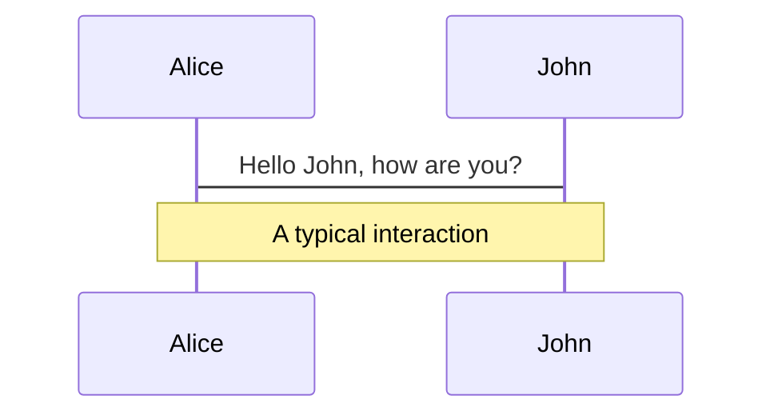
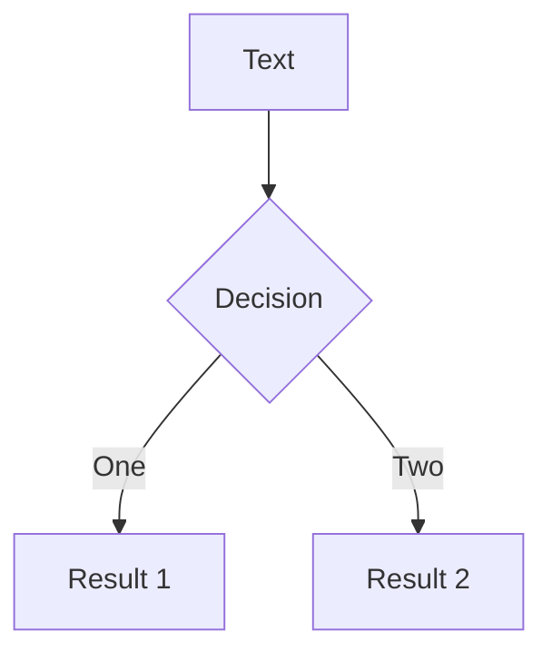
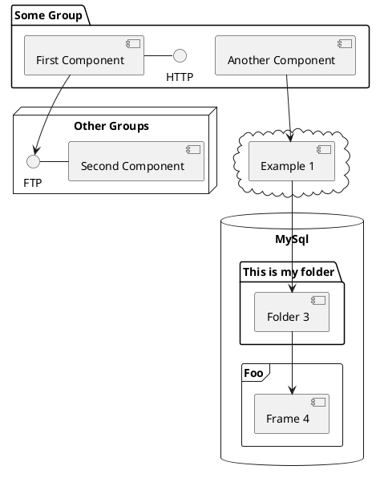

---
# try also 'default' to start simple
theme: geist
# random image from a curated Unsplash collection by Anthony
# like them? see https://unsplash.com/collections/94734566/slidev
background: https://source.unsplash.com/collection/94734566/1920x1080
# apply any windi css classes to the current slide
class: 'text-center'
# https://sli.dev/custom/highlighters.html
highlighter: shiki
# show line numbers in code blocks
lineNumbers: false
# some information about the slides, markdown enabled
info: |
  ## Intro to DevOps with Errbot
  An introduction to the world of DevOps

# persist drawings in exports and build
drawings:
  persist: false
---

# Intro to DevOps with <span>Errbot</span>

<div class="pt-12">
  <span @click="$slidev.nav.next" class="px-2 py-1 rounded cursor-pointer" hover="bg-white bg-opacity-10">
    Press Space to begin the journey <carbon:arrow-right class="inline"/>
  </span>
</div>

<div class="abs-br m-6 flex gap-2">
  <button @click="$slidev.nav.openInEditor()" title="Open in Editor" class="text-xl icon-btn opacity-50 !border-none !hover:text-white">
    <carbon:edit />
  </button>
  <a href="https://github.com/slidevjs/slidev" target="_blank" alt="GitHub"
    class="text-xl icon-btn opacity-50 !border-none !hover:text-white">
    <carbon-logo-github />
  </a>
</div>

<style>
span {
  background-color: #2B90B6;
  background-image: linear-gradient(45deg, #4EC5D4 10%, #146b8c 20%);
  background-size: 100%;
  -webkit-background-clip: text;
  -moz-background-clip: text;
  -webkit-text-fill-color: transparent;
  -moz-text-fill-color: transparent;
}
</style>

<!--
The last comment block of each slide will be treated as slide notes. It will be visible and editable in Presenter Mode along with the slide. [Read more in the docs](https://sli.dev/guide/syntax.html#notes)
-->

---

# What is DevOps?

DevOps is a set of combined practices that merge development (Dev) and operations (Ops) together

- 💡 Continuous planning
- ⚡ Rapid application development
- 👯 Sharable development environments
- 🤖 Automated and repeatable builds & tests
- 🚀 CI/CD pipelines
- 🔭 Obervability
- 🔒 Security

<br>
<br>

Read more about [what is DevOps](https://en.wikipedia.org/wiki/DevOps)

<!--
You can have `style` tag in markdown to override the style for the current page.
Learn more: https://sli.dev/guide/syntax#embedded-styles
-->

<style>
h1 {
  background-color: #2B90B6;
  background-image: linear-gradient(45deg, #4EC5D4 10%, #146b8c 20%);
  background-size: 100%;
  -webkit-background-clip: text;
  -moz-background-clip: text;
  -webkit-text-fill-color: transparent;
  -moz-text-fill-color: transparent;
}
</style>

---

# DevOps Visualized


---

# Plan 💡

The planning phase of DevOps is often [agile software development](https://en.wikipedia.org/wiki/Agile_software_development)

- • Iterative
- • Continuous
- • Can (and will) change frequently
- • No "big bang" launch, an iterative approach

> For this demo we will be planning the launch of a new chat bot command `.devops`

<style>
code {
  color: orange;
}
blockquote {
  color: #A9A9A9;
}
</style>

---

# Code 💻

The coding phase of DevOps is where ideas come to life... and where nightmares are born

```python
if production == "down":
  print("This does not bring joy")
```

- 👯 Develop in sharable and automated environments
- 🖌️ Adopt a common code style (use a linter)
- ⚙️ Use a version control system
- 💾 Commit and push often
- 👀 Work in the open, get feedback, request reviews

> For the DevOpsDaysLA demo, we will be writting code in [GitHub codespaces](https://github.com/features/codespaces)

<style>
code {
  color: orange;
}
blockquote {
  color: #A9A9A9;
}
</style>

---

# Build 📦

The build phase of DevOps is where the code is compiled and often saved as an artifact for later deployment

- 🛠️ Build your application / binaries in a repeatable environment (CI/CD)
- 🐳 Containerize applications and services where you can
- 🔒 Secure your software supply chain when building applications
- 🔑 Seperate packages, containers, and binaries from configurations and secrets

> For the DevOpsDaysLA demo, we will be using Docker to containerize and build our application

<style>
blockquote {
  color: #A9A9A9;
}
</style>

---

# Test 🧪

The test phase of DevOps is where the application is... tested!

- 👯 Repeatable test environment (CI/CD + Docker)
- 👨‍🔬 Unit tests
- 🌐 Integration tests
- 🔬 Container scanning
- 🔎 SAST & DAST - Code scanning

> For the DevOpsDaysLA demo, you will get exposure to unit tests, container scanning, and static analysis

<style>
blockquote {
  color: #A9A9A9;
}
</style>


---

# LaTeX

LaTeX is supported out-of-box powered by [KaTeX](https://katex.org/).

<br>

Inline $\sqrt{3x-1}+(1+x)^2$

Block
$$
\begin{array}{c}

\nabla \times \vec{\mathbf{B}} -\, \frac1c\, \frac{\partial\vec{\mathbf{E}}}{\partial t} &
= \frac{4\pi}{c}\vec{\mathbf{j}}    \nabla \cdot \vec{\mathbf{E}} & = 4 \pi \rho \\

\nabla \times \vec{\mathbf{E}}\, +\, \frac1c\, \frac{\partial\vec{\mathbf{B}}}{\partial t} & = \vec{\mathbf{0}} \\

\nabla \cdot \vec{\mathbf{B}} & = 0

\end{array}
$$

<br>

[Learn more](https://sli.dev/guide/syntax#latex)

---

# Diagrams

You can create diagrams / graphs from textual descriptions, directly in your Markdown.

<div class="grid grid-cols-3 gap-10 pt-4 -mb-6">







</div>

[Learn More](https://sli.dev/guide/syntax.html#diagrams)


---
layout: center
class: text-center
---

# Learn More

[Documentations](https://sli.dev) · [GitHub](https://github.com/slidevjs/slidev) · [Showcases](https://sli.dev/showcases.html)
