---
# try also 'default' to start simple
theme: geist
# random image from a curated Unsplash collection by Anthony
# like them? see https://unsplash.com/collections/94734566/slidev
background: https://source.unsplash.com/collection/94734566/1920x1080
# apply any windi css classes to the current slide
class: 'text-center'
# https://sli.dev/custom/highlighters.html
highlighter: shiki
# show line numbers in code blocks
lineNumbers: false
# some information about the slides, markdown enabled
info: |
  ## Intro to DevOps with Errbot
  An introduction to the world of DevOps

# persist drawings in exports and build
drawings:
  persist: false
---

# Intro to DevOps with <span>Errbot</span>

<div class="pt-12">
  <span @click="$slidev.nav.next" class="px-2 py-1 rounded cursor-pointer" hover="bg-white bg-opacity-10">
    Press Space to begin the journey <carbon:arrow-right class="inline"/>
  </span>
</div>

<div class="abs-br m-6 flex gap-2">
  <button @click="$slidev.nav.openInEditor()" title="Open in Editor" class="text-xl icon-btn opacity-50 !border-none !hover:text-white">
    <carbon:edit />
  </button>
  <a href="https://github.com/slidevjs/slidev" target="_blank" alt="GitHub"
    class="text-xl icon-btn opacity-50 !border-none !hover:text-white">
    <carbon-logo-github />
  </a>
</div>

<style>
span {
  background-color: #2B90B6;
  background-image: linear-gradient(45deg, #4EC5D4 10%, #146b8c 20%);
  background-size: 100%;
  -webkit-background-clip: text;
  -moz-background-clip: text;
  -webkit-text-fill-color: transparent;
  -moz-text-fill-color: transparent;
}
</style>

<!--
The last comment block of each slide will be treated as slide notes. It will be visible and editable in Presenter Mode along with the slide. [Read more in the docs](https://sli.dev/guide/syntax.html#notes)
-->

---

# What is DevOps?

DevOps is a set of combined practices that merge development (Dev) and operations (Ops) together

- 💡 Continuous planning
- ⚡ Rapid application development
- 👯 Sharable development environments
- 🤖 Automated and repeatable builds & tests
- 🚀 CI/CD pipelines
- 🔭 Obervability
- 🔒 Security

<br>
<br>

Read more about [what is DevOps](https://en.wikipedia.org/wiki/DevOps)

<!--
You can have `style` tag in markdown to override the style for the current page.
Learn more: https://sli.dev/guide/syntax#embedded-styles
-->

<style>
h1 {
  background-color: #2B90B6;
  background-image: linear-gradient(45deg, #4EC5D4 10%, #146b8c 20%);
  background-size: 100%;
  -webkit-background-clip: text;
  -moz-background-clip: text;
  -webkit-text-fill-color: transparent;
  -moz-text-fill-color: transparent;
}
</style>

---

# DevOps Visualized


---

# Plan 💡

The planning phase of DevOps is often [agile software development](https://en.wikipedia.org/wiki/Agile_software_development)

- • Iterative
- • Continuous
- • Can (and will) change frequently
- • No "big bang" launch, an iterative approach

> For this demo we will be planning the launch of a new chat bot command `.devops`

<style>
blockquote {
  color: #A9A9A9;
}
</style>

---

# Code 💻

The coding phase of DevOps is where ideas come to life... and where nightmares are born

```python
if production == "down":
  print("This does not bring joy")
```

- 👯 Develop in sharable and automated environments
- 🖌️ Adopt a common code style (use a linter)
- ⚙️ Use a version control system
- 💾 Commit and push often
- 👀 Work in the open, get feedback, request reviews

> For the DevOpsDaysLA demo, we will be writting code in [GitHub codespaces](https://github.com/features/codespaces)

<style>
blockquote {
  color: #A9A9A9;
}
</style>

---

# Build 📦

The build phase of DevOps is where the code is compiled and often saved as an artifact for later deployment

- 🛠️ Build your application / binaries in a repeatable environment (CI/CD)
- 🐳 Containerize applications and services where you can
- 🔒 Secure your software supply chain when building applications
- 🔑 Seperate packages, containers, and binaries from configurations and secrets

> For the DevOpsDaysLA demo, we will be using Docker to containerize and build our application

<style>
blockquote {
  color: #A9A9A9;
}
</style>

---

# Test 🧪

The test phase of DevOps is where the application is... tested!

- 👯 Repeatable test environment (CI/CD + Docker)
- 👨‍🔬 Unit tests
- 🏝️ Staging Environment
- 🌐 Integration tests
- 🔬 Container scanning
- 🔎 SAST & DAST - Code scanning

> For the DevOpsDaysLA demo, you will get exposure to unit tests, container scanning, and static analysis

<style>
blockquote {
  color: #A9A9A9;
}
</style>

---

# Release 🏷️

The release stage of DevOps is where the application is release to users.

Examples include:

- 📦 Publishing a binary to an opensource repository
- 🏷️ Publishing a release label and Git tag for an application
- 🔢 Releasing a new version with an installer for a desktop application

---

# Deploy 🚀

The deploy stage of DevOps is my personal favorite. This is where code is deployed into systems in production

- 🧱 Infrastructure as Code
- ⏩ CI/CD Pipelines
- 🚀 Deployment

---

# Operate 🧰

The operate stage of DevOps is where the application is used by real users and we react to that usage

- 🏗️ Scaling
- 🐛 Bug Reports
- 💬 Continuous feedback
- 🔒 Rolling updates for security

---

# Monitor 🔎

The monitor stage of DevOps is where the application is "monitored" via its metrics, events, and logs

- 📊 Gather Metrics
- 📈 Visualize and Dashboard all the things
- 📝 Collect logs and events
- 🔍 Search and audit for anomalies
- 🔔 Trigger alerts and notifications

---

# What is Errbot? 🤖

[Errbot](https://github.com/GrantBirki/errbot) is an implementation of the [errbotio/errbot](https://github.com/errbotio/errbot) framework.

My version of errbot differs from the original in the following ways:

- • Containerized
- • Comes with pre-built features and chat commands
- • Custom helper functions
- • Altered base plugins and code
- • Custom configuration

> My version of errbot is specifically built around Discord, but many features natively support Slack as well. Check out the upstream source for [errbotio/errbot](https://github.com/errbotio/errbot) to learn more about supported backends, configuration, and bot development

<style>
blockquote {
  color: #A9A9A9;
}
</style>

---

# What can Errbot do?

Errbot can do **literally** anything you can write Python code to do!

> [Errbot Video Demo](https://giant.gfycat.com/UnripeReasonableErmine.mp4)

<style>
blockquote {
  color: #A9A9A9;
}
</style>

---

# Errbot for Fun

- • Get the [DownDetector](https://downdetector.com/) status of a service
- • Complement or Insult your friends
- • Remember a string of text for later
- • Get a random fact
- • Get the weather
- • Find the value of an item in a game
- • Join a Discord channel and play some music
- • Get the price of a stonk or crypto currency
- • Read a message over text to speech

---

# Errbot for Work

- • Get the status of a deployed service
- • DNS lookups
- • Update a firewall rule
- • Start a Kubernetes deployment
- • Trigger a deployment
- • Merge a pull request
- • Create a GitHub issue
- • Add a comment to a servicenow ticket
- • Create a Jira issue
- • Page an on-call engineer
- • Post your daily standup status
- • Get a post service metrics to a channel

---

# Hands-on Workshop Time 👐

In this workshop, we will be doing the following:

- 📚 Build our documentation page - [GitHub Pages](https://pages.github.com/)
- 💻 Implement our new `.devops` chatbot command
- 📦 Building the bot using [skaffold](https://skaffold.dev/) with our new command (Thanks [@murriel](https://github.com/murriel)!)
- 🧪 Ensure our test suite is passing
- 🔒 Run SAST on our code and container scanning on our container image
- 🤹 Interact and use our new chat command
- 🔭 Observe our bot's usage with Grafana & Loki
- 🚀 Run a real world CI/CD pipeline and deployment

---

# Getting Started 💡

- 1: Go to [github.com/DevOpsDaysLA/workshop-1](https://github.com/DevOpsDaysLA/workshop-1) and click "Fork" in the upper right corner
- 2: Ensure you fork the repo into the [DevOpsDaysLA](https://github.com/DevOpsDaysLA) organization. Note: If you are not part of the DevOpsDaysLA workshop, you can fork the repo to your personal GitHub account instead
- 3: Upon the successful fork, you will notice a GitHub action workflow has started for your documentation page
- 4: Go to your repo settings and ensure your GitHub pages site is accessible to view your documentation

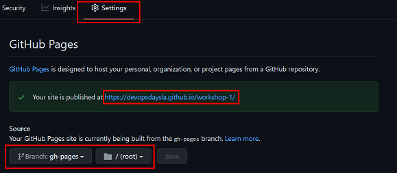

---

# GitHub Pages 📄

[GitHub Pages](https://pages.github.com/) is a free service for hosting static website content on GitHub.com

Commits / Pushes to the `main` branch automatically update our documentation site

```yaml
name: pages
on:
  push:
    branches:
      - main
jobs:
  deploy:
    runs-on: ubuntu-latest
    steps:
      - uses: actions/checkout@ec3a7ce113134d7a93b817d10a8272cb61118579 # pin@v2
      - uses: actions/setup-python@f38219332975fe8f9c04cca981d674bf22aea1d3 # pin@v2
        with:
          python-version: 3.x
      - run: pip install mkdocs-material
      - run: mkdocs gh-deploy --force
```

---

# Pages GitHub Actions Workflow ⏩

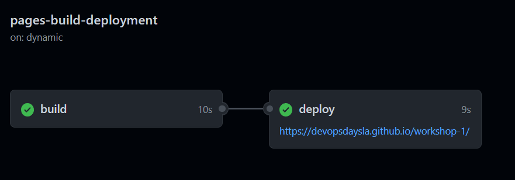

Hooray! We not have all the nitty gritty documentation for our bot publically hosted on GitHub Pages!

---

# Setup

To begin implementing our `.devops` bot command, we need to first start our dev environment:

**DevOpsDaysLA Workshop:**

Simply create a new GitHub Codespace


**Non-DevOpsDaysLA Workshop:**

[Public setup documentation](https://errbot.birki.io/)

---

# Codespaces 💻

If you are apart of the DevOpsDaysLA workshop, you will be able to create a new GitHub Codespace for development

**What is GitHub Codespaces?**

- ☁️ Cloud hosted development environment
- 👯 Consistent, repeatable, and shareable
- 🚧 Removes the "it works on my machine" barrier
- 🔥 Saves us from dependency hell
- ⭐ Allows developers to deploy a dev environement in one-click and begin working on a project

You can read more about GitHub Codespaces [here](https://github.com/features/codespaces)

> Note: If you are not apart of the DevOpsDaysLA workshop, you will **not** have free access to GitHub codespaces and will need to setup errbot [locally for development](https://errbot.birki.io/setup/)

<style>
blockquote {
  color: #A9A9A9;
}
</style>

---

# Connect to Codespace

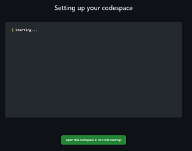

You will now connect to Codespaces through your browser. If you have [Visual Studio Code](https://code.visualstudio.com/) installed, you can optionally attach there as well.

Our Codespace environment comes pre-installed with all the dependencies we need to run errbot locally and develop new features.

> Note: If you are **not** apart of the DevOpsDaysLA workshop, you will be doing all the following steps from here on locally and not in GitHub Codespaces

<style>
blockquote {
  color: #A9A9A9;
}
</style>

---

# Generating a Bot Token 🔑

The first step to build our bot locally is to generate a bot token. This workshop uses Discord but you can also use Slack or [other chat services](https://errbot.readthedocs.io/en/latest/user_guide/setup.html#id1) as well.

**Discord:**

- 1: Navigate to the [Discord App Dashboard](https://discord.com/developers/applications)
- 2: Click the "New Application" button - Name your bot `firstname-errbot-dev`
- 3: Click the "Bot" tab -> "Add Bot"
- 4: Copy down your bot token
- 5: Under the "General Information" tab, copy down your bot's `application id`


---

# Configure the Bot 🔧

For this step, all you need to do is "check the box" for "Server Members Intent":

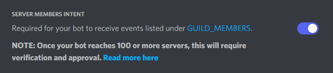

---

# Invite the Bot 🔗

The next step is to invite your newly created bot to your Discord server.

Use the `application id` from the previous step to invite your bot to your server and paste it into the link below:

```text
https://discord.com/api/oauth2/authorize?client_id=<application_id>&permissions=36734976&scope=bot
```

Paste the formatted link above link into your browser and add the bot to your desired server!

> For the DevOpsDaysLA workshop you can join the following Discord server for testing and bot invites: [Server Invite Link](https://discord.gg/76q9Ca4RzW)

<style>
blockquote {
  color: #A9A9A9;
}
</style>

---

# Setup Bot Token 🔑

From your codespace (or local) console, execute the following commands:

Create the `secret.yaml` file for your local k8s deployment:

```text
cp script/k8s/errbot/secret.yaml.example script/k8s/errbot/secret.yaml
```

[base64](https://kubernetes.io/docs/concepts/configuration/secret/#overview-of-secrets) encode your bot token (from the previous slide):

```text
python3 script/base64string.py --string <bot_token>
```

Add your base64 encoded bot token to the `script/k8s/errbot/secret.yaml` file:

`"${CHAT_SERVICE_TOKEN}"` -> `"your-bot-token-here"`

---

# Bot Admin 👨‍🔬

Before you start your bot, set yourself as the bot admin:

Edit the `script/k8s/errbot/deployment.yaml` file like so:

`value: "Birki#0001" # change to your own handle` -> `value: "yourname#0001"`

> Note: You can find your `name#id` in the bottom left of your Discord client or on your profile page

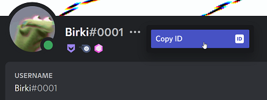

---

# Start the Bot with Skaffold ☸️

We will be using [Skaffold](https://skaffold.dev/) to run our bot for development (either in Codespaces or locally)

Start our [minikube](https://minikube.sigs.k8s.io/docs/start/), cluster:

> Note: You may need to run `sudo chown -R $USER $HOME/.minikube; chmod -R u+wrx $HOME/.minikube` to start your minikube cluster in Codespaces

```text
minikube start --profile custom

skaffold config set --global local-cluster true

eval $(minikube -p custom docker-env)
```

Run the bot with Skaffold (and tail the logs):

```text
skaffold dev --tail=true
```

<style>
blockquote {
  color: #A9A9A9;
}
</style>

---

# Development Environment 1,000 Foot Overview 🦅

While the Skaffold command is running, let's look at our dev env ([source](https://errbot.birki.io/deployment/)):

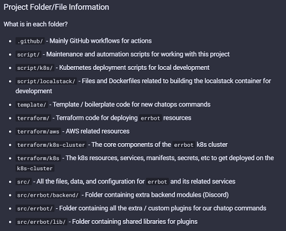

---

# What are Containers? 🐳

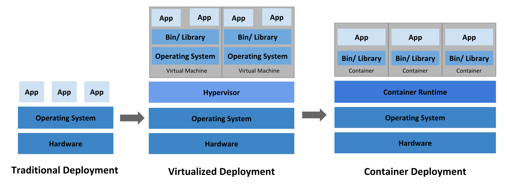

---

# What is Kubernetes? ☸️

Kubernetes, or k8s, is an open source platform that automates container orchestration and application deployment.

- • Declarative language for defining containers and workloads (k8s manifests)
- • Scalable, highly available, and resilient
- • Open source
- • Creating by Google

---

# Kubernetes Diagram 🗺️

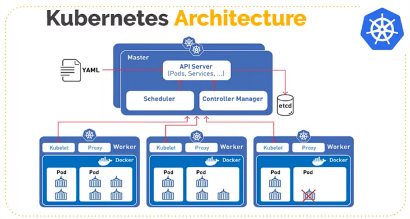

---

# Kubernetes Files 📂

The `script/k8s/` directory contains all the files we need to deploy our bot to Kubernetes locally (using Skaffold)

**Benefits of using Skaffold:**

- • Live reload (changes to source files or k8s manifests)
- • Handles all `kubectl` commands for us
- • Faster dev cycles
- • Very close to our production environment (if not identical)

**Alternative dev building options:**

- 🐳 Docker-compose - The `make run` command from the root of this repo is a wrapper command for building locally with Docker-compose
- ☸️ Minikube - The `make kube` command from the root of this repo is a wrapper command for building locally with minikube using `kubectl`

---

# Back to the Terminal 💻

Going back to our terminal, we should see live output from our bot running in k8s via skaffold.

Additionally, the following has happened:

- • 🟢 The configured bot owner got a ping that the bot is now online
- • 💬 The bot can now been as online on our Discord server
- • ⌨️ We can now type a command and our bot will respond -> `!uptime`

Let's go ahead and press `ctrl+c` in our terminal running skaffold to stop the bot

> Note: You can also test out other commands that are available. Try `!help`

<style>
blockquote {
  color: #A9A9A9;
}
</style>

---

# Creating our very own chat command!

> 💡 Plan Stage of DevOps

We want a new command that returns a link to the DevOps life-cycle

Discord will conveniently render this link as an image for us.

This will be a brand new chat command so we will need to implement it and add the associated tests for our new code

<style>
blockquote {
  color: #A9A9A9;
}
</style>

---

# Code for the Chat Command 📝

> 💻 Code Stage of DevOps

Another engineer has already written most of the code for our new command.

Let's copy that code into our `src/errbot/plugins/` directory:

```text
mkdir src/errbot/plugins/devops

cp demo/code/devops/* src/errbot/plugins/devops/
```

<style>
blockquote {
  color: #A9A9A9;
}
</style>

---

# Build with Skaffold ☸️

> 📦 Build Stage of DevOps

Now that we have our new command, we need to build our bot with Skaffold:

```text
skaffold dev --tail=true
```

Once the container starts up, run the new command: `!devops`

<style>
blockquote {
  color: #A9A9A9;
}
</style>

---

# Fix our Command 🚨

> 💻 Code Stage of DevOps

Oh no! Our command is borked! Back to our editor to fix the bad code:

```python
# Delete these lines
if self.chaos():
  return "CHAOS"
...
# Delete this function
def chaos(self):
  """
  This does not bring joy
  """
  if random() > 0.5:
    return True
  else:
    return False
```

Redeploy and test with `skaffold dev --tail=true` -> `!devops`

<style>
blockquote {
  color: #A9A9A9;
}
</style>

---

# Lint 🧹

> 💻 Code Stage of DevOps

A best pratice for all projects is to use a linter or some form of code standard.

For this project, we are using [Black](https://black.readthedocs.io/en/stable/).

**Run the linter:**

```text
script/lint
```

<style>
blockquote {
  color: #A9A9A9;
}
</style>

---

# Run our Test Suite 🔬

> 🧪 Test Stage of DevOps

The other engineer also wrote some tests for us, let's copy those over as well:

```text
cp demo/code/tests/devops_test_example.py tests/plugins/test_devops.py
```

Run the test suite using [pytest](https://docs.pytest.org/en/latest/):

```text
script/test
```

> Note: Tests like to live in CI/CD pipelines

<style>
blockquote {
  color: #A9A9A9;
}
</style>

---

# Fix our Test 🚨

> 🧪 Test Stage of DevOps

Checking our test output, we expect that a a url with a `.jpg` extension is returned. However, the actual image we are returning is a `.png`. Let's fix that:

```python
# tests/plugins/test_devops.py
assert "demo/assets/devops.png" in testbot.pop_message()
```

🎉

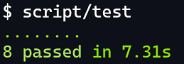

<style>
blockquote {
  color: #A9A9A9;
}
</style>

---

# SAST 🔎

> 🔒 Security Stage of DevOps - Shift Left!

[SAST](https://en.wikipedia.org/wiki/Static_application_security_testing) is a testing methodology for detecting security vulnerabilities in software.

It generally takes place by scanning files and looking for misconfigurations, bad practices, and other security issues.

> Note: SAST likes to live in CI/CD pipelines

<style>
blockquote {
  color: #A9A9A9;
}
</style>

---

# TFSEC 🔒

> 🔒 Security Stage of DevOps - Shift Left!

[TFSEC](https://github.com/aquasecurity/tfsec) is a SAST testing tool that scans Terraform files for security issues.

Let's run it and check the output:

```text
tfsec terraform/
```

We won't make any changes here but it is good to get familiar with the tool

> Note: TFSEC likes to live in CI/CD pipelines

<style>
blockquote {
  color: #A9A9A9;
}
</style>

---

# KUBESEC 🔒

> 🔒 Security Stage of DevOps - Shift Left!

[KUBESEC](https://github.com/controlplaneio/kubesec) is another SAST tool for scanning kubernetes manifests.

**Example Usage:**

```text
kubesec scan script/k8s/errbot/deployment.yaml | jq
```

**Make a check fail and then fix it again:**

1. 1: Edit: `script\k8s\errbot\deployment.yaml` -> comment out: `runAsUser: 10001`
2. 2: Run: `kubesec scan script/k8s/errbot/deployment.yaml | jq`
3. 3: Observe the output warning that the `runAsUser` check is now failing
4. 4: Fix it back by uncommenting the `runAsUser` field in the k8s manifest

> Note: KUBESEC likes to live in CI/CD pipelines

<style>
blockquote {
  color: #A9A9A9;
}
</style>

---

# Trivy 🔒

> 🔒 Security Stage of DevOps - Shift Left!

[Trivy](https://github.com/aquasecurity/trivy) is a container / misconfiguration / IaC vulnerability scanner.

**Let's hunt for some vulnerabilities in our container image with Trivy:**

```text
docker build -t scan-errbot:latest src/errbot/

trivy image scan-errbot:latest
```

**If no vulnerabilities are found, let's create one 🐛:**

Edit: `src/errbot/requirements.txt` -> add: `markdown2==2.2.2` anywhere to that file

Run the build + scan again (as seen above)

> Note: Trivy likes to live in CI/CD pipelines

<style>
blockquote {
  color: #A9A9A9;
}
</style>

---

# Pull Request 🏷️

> 🏷️ Release Stage of DevOps

For the **Release** and **Deploy** steps, we will have to do a bit of *pretending* since we do not have a production environement.

Our new `!devops` command is all ready to be released to production and used by the world!

**So far we have done the following:**

- ✅ Created our new chat command
- ✅ Ran our linter
- ✅ Ran our test suite
- ✅ Built the image and tested locally with Skaffold
- ✅ Ran security checks with TFSEC, Kubesec, and Trivy
- 💡 Opened a pull request and got proper approvals / peer reviews (pretend)
- 🏷️ Tagged our release with a new version number and updated the change log with our new feature (pretend)

<style>
blockquote {
  color: #A9A9A9;
}
</style>

---

# Deploy 🚀

> 🚀 Deploy Stage of DevOps

We now press the **Merge** button on our pull request and this will automatically trigger our GitHub Actions pipeline to deploy our changes to production!

Again, you will not have a production environement with a cloud provider as this will incur costs. In the next slides I will give an overview of our GitHub Actions pipeline and do a live demo of a deployment to Azure.

<style>
blockquote {
  color: #A9A9A9;
}
</style>

---

# GitHub Actions ⏩

> 🚀 Deploy Stage of DevOps

[GitHub Actions](https://github.com/features/actions) runs two types of pipelines for this project:

- 💡 - **Plan:** This is the pipeline that runs before the pull request is merged to plan changes
- 🚀 - **Deploy:** This is the pipeline that runs after the pull request is merged to `main` to deploy changes

All GitHub Actions workflow definitions can be found in the `.github/workflows/` directory.

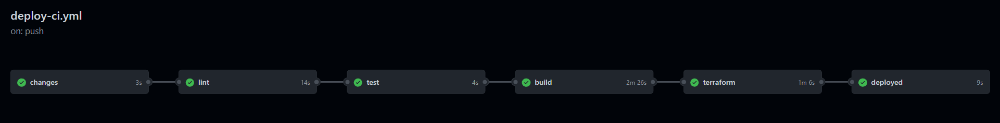

<style>
blockquote {
  color: #A9A9A9;
}
</style>

---

# Terraform Exploration 🌎

> 🚀 Deploy Stage of DevOps

[Terraform](https://cloud.hashicorp.com/products/terraform) is a tool for building, deploying, and managing infrastructure as code.

**This project uses Terraform to do the following:**

- • Creates a Kubernetes Cluster (Azure AKS)
- • Creates a container registry to store Docker images (Azure ACR)
- • Creates DynamoDB tables for storing remote bot state (AWS)
- • Creates, applies, and manages Kubernetes manifests for errbot and its related services (Azure AKS)

---

# Terraform Example #1

Infrastructure as Code (IAC) is here to stay and deeply embedded in DevOps. Let's take a look at a few Terraform examples.

**AWS DynamoDB Table:**

```hcl
module "dynamodb_table" {
  source  = "terraform-aws-modules/dynamodb-table/aws"
  version = "1.1.0"

  name                           = "remember"
  hash_key                       = "discord_server_id"
  range_key                      = "rem_key"
  point_in_time_recovery_enabled = true

  attributes = [
    { name = "discord_server_id", type = "N" },
    { name = "rem_key", type = "S" }
  ]

  tags = { managed_by = "terraform" }
}
```

---

# Terraform Example #2

A little more complex example now..

**Azure Container Registry:**

```hcl
resource "azurerm_role_assignment" "role_acrpull" {
  scope                            = azurerm_container_registry.acr.id
  role_definition_name             = "AcrPull"
  principal_id                     = azurerm_kubernetes_cluster.aks.kubelet_identity.0.object_id
  skip_service_principal_aad_check = true
}

resource "azurerm_container_registry" "acr" {
  name                = "${var.PROJECT_NAME}acr"
  resource_group_name = azurerm_resource_group.default.name
  location            = var.CLOUD_LOCATION
  sku                 = "Basic"
  admin_enabled       = true

  tags = { managed_by = "terraform" }
}
```

---

# Terraform Example #3.1

A little bit harder than #2.. deploying our chatbot containers!

**Kubernetes Manifests via Terraform:**

```hcl
# terraform/k8s/main.tf
module "errbot" {
  source                = "./modules/containers/errbot"
  IMAGE_TAG             = var.IMAGE_TAG
  CHAT_SERVICE_TOKEN    = var.CHAT_SERVICE_TOKEN
  ACR_NAME              = data.azurerm_container_registry.acr.name
  NAMESPACE             = "errbot"
}
```

---

# Terraform Example #3.2

In the following module: `"./modules/containers/errbot"` we now tell Terraform where and what order to load our k8s manifests:

```hcl
data "kubectl_path_documents" "errbot_deployment_manifest" {
  depends_on = [
    data.kubectl_path_documents.errbot_namespace_manifest, # wait for this to be created
    data.kubectl_path_documents.errbot_secret_manifest # wait for this to be created
  ]
  pattern = "modules/containers/errbot/deployment.yaml" # path to manifest
}

resource "kubectl_manifest" "errbot_deployment" {
  depends_on = [
    data.kubectl_path_documents.errbot_namespace_manifest
  ]
  count     = length(data.kubectl_path_documents.errbot_deployment_manifest.documents)
  yaml_body = element(data.kubectl_path_documents.errbot_deployment_manifest.documents, count.index)
}
```

---

# Terraform Example #3.3

Finally, Terraform parses the `deployment.yaml` manifest and adds in any environment variables.

Example: `terraform/k8s/modules/containers/errbot/deployment.yaml`

---

# Live Deploy Demo 🎥

> 🚀 Deploy Stage of DevOps

TODO: Notes for this slide will be added after the first live demo. Public Pull Requests will be used

<style>
blockquote {
  color: #A9A9A9;
}
</style>

---

# Operate the Bot 🤖

> 🧰 Operate Stage of DevOps

Usually, this is customers, clients, or the public would interact with your service. For this demo, we will be those users.

Go ahead and interact with your running bot and have some fun!

**Commands to try:**

- • `!remember <key> is <value>` - Stores a value in DynamoDB
- • `!insult @user` - Use at your own risk, its crowd sourced
- • `!lmf <summoner_name>` - Get the last League of Legends match for a summoner
- • `!play <song name or youtube url>` - Join a voice channel and run this command to get some tunes
- • `!crypto <ticker>` - Get the current price of a crypto currency
- • `!sparkle @user for <reason>` - Show your appreciation to someone

> `!help` for a full list of available commands

<style>
blockquote {
  color: #A9A9A9;
}
</style>

---

# Operations and Scaling

> 🧰 Operate Stage of DevOps

Another part of the DevOps journey is to scale your service to meet your needs.

For this demo we won't be scaling but it is important to know how to do so and what your options are:

- • **Autoscaling** - Scale your service based on the number of requests (e.g. `kubectl autoscale deployment errbot --cpu-percent=50`)
- • **Horizontal Scaling** - Scale your service based on the number of replicas (e.g. `kubectl scale deployment errbot --replicas=3`)
- • **Vertical Scaling** - Scale your service by making each container use more resources (e.g. `kubectl scale deployment errbot --cpu=2 --memory=2Gi`)

> Note: Horizontal scaling doesn't work well for traditional chat bots since they will repond multiple times to the same message. 

<style>
blockquote {
  color: #A9A9A9;
}
</style>

---

# Monitoring and Logging with Grafana 📊

> 🔎 Monitor Stage of DevOps

For this demo, we are using Promtail + Loki + Grafana to collect logs and metrics for our chatbot

1. **1:** Open a new terminal window while `skaffold dev` is still running

2. **2:** Get your Grafana password (username will be `admin`):

    ```text
    kubectl get secret --namespace observability grafana -o jsonpath="{.data.admin-password}" | base64 --decode ; echo
    ```

3. **3:** Port forward to your Grafana instance

    ```text
    kubectl port-forward --namespace observability service/grafana 3000:80
    ```

    > If your IDE does not automatically direct you, simply go to http://127.0.0.1:3000/login after port forwarding with kubectl

<style>
blockquote {
  color: #A9A9A9;
}
</style>

---

# Logs in Grafana

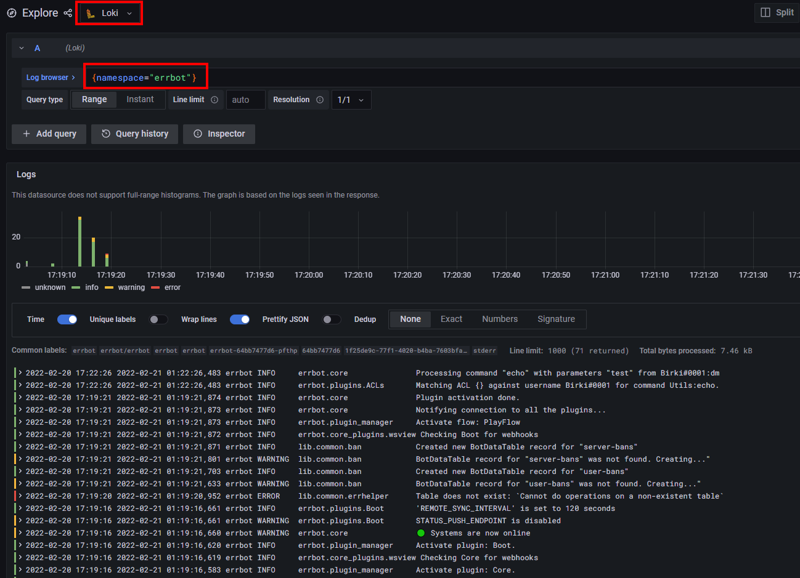

---

# You made it!

If you have made it this far, you should have accomplished the following:

- ✅ Self-hosted your own documenation
- ✅ Added a new feature to your very own chatbot
- ✅ Built, tested, and deployed your container with Skaffold in k8s
- ✅ Checked your application for security vulnerabilities
- ✅ Learned a bit about Kubernetes, Terraform, and tying them together with GitHub Actions through CI/CD
- ✅ Monitored your application with Promtail and Grafana
- ✅ Learned about a new tool or two
- ✅ Gained some insight into the DevOps life-cycle
- ✅ Had fun!

---

# Learn More 📖

Curious to learn more about DevOps?

- • [awesome-devops](https://github.com/wmariuss/awesome-devops) - A curated list of DevOps resources
- • [90 Days of DevOps](https://github.com/MichaelCade/90DaysOfDevOps) - A journey through DevOps in 90 days
- • [DevOps Exercises](https://github.com/bregman-arie/devops-exercises) - Questions and interview challenges about DevOps
- • [DevOps Resources](https://github.com/bregman-arie/devops-resources) - A curated repo packed full of DevOps resources
- • [8 Phases of DevOps](https://medium.com/taptuit/the-eight-phases-of-a-devops-pipeline-fda53ec9bba) - The 8 phases of DevOps defined
