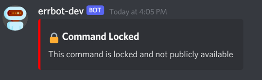

# Helper Functions

This guide contains details around a few helper functions that can be used to enhance the functionality of your chatbot functions.

## What is a helper function?

A helper function is anything we consider a utility, helper, or shared library that can enhance chat functions. This is code that can be reused in multiple chat functions as well.

## Where are the helper functions located?

All helper functions, libraries, and general utilities are stored in the `src/errbot/plugins/lib` folder.

Subdirs:

- `chat`: Helper functions specific to chat services such as Discord, Slack, etc.
- `common`: Common functions that can be used all over the place. Stuff like datetime formatting, logging, hashes, searching, etc
- `database`: Helper functions for database operations (specifically for DynamoDB)

## Top Helper Functions ⭐

There are a few helper functions that are super useful for the bot and will be used in most functions. There will be details about these functions below but the rest you will need to dig into the `src/errbot/plugins/lib` and read the doc strings to understand how they work.

> Note: All examples below will be using the basic bot command template from the main README.md from this repo

### Server Lock

Certain bot commands can and will be locked to servers. Whether for testing, privacy or security reasons you may want to lock certain commands to a specific server.

This can be accomplished by using the `SERVER_LOCK_ALLOW_LIST='123456789,987654321'` environment variable which can be set in the `config.env` file. First, check out that file to see the comments with more details around the environment variable.

To actually use the environement variable in conjunction the lock function **and** a bot function to "lock" you need to add the helper method to a bot command:

```python
from errbot import BotPlugin, botcmd
from lib.chat.chatutils import ChatUtils # import the ChatUtils lib

chatutils = ChatUtils() # create a ChatUtils object

class Hello(BotPlugin):
    """Example 'Hello, world!' plugin for Errbot"""

    @botcmd
    def hello(self, msg, args):
        """Return the phrase "Hello, world!" in chat"""

        # check if the command is server locked - True means that it is locked and NOT in the allow list
        if chatutils.locked(msg, self):
            # since it is locked, we immediately exit the bot function and do not continue!
            return

        return "Hello, world!"
```

The `msg` variable in `def hello(self, msg, args)` contains a Discord server id that will be checked against the `SERVER_LOCK_ALLOW_LIST` environment variable. If `chatutils.locked(msg, self)` returns True, it means that the lock is enabled and the command is not allowed to be executed. It will automatically return a message like the one below to the user who invoked the command from a server that is not in the allow list:



If the user invoked the command from a server that **is** in the allow list, the command will execute normally.

### ErrHelper

The ErrHelper library is a very important library in terms of logging and error reporting. If the `SENTRY` environment variable is configured properly in the `creds.env` file, then this library is used to send exception reports to Sentry automatically. There is also a few helper functions available in this library that can be very useful in chat functions:

1. Manually send an exception report to Sentry (ex: after capturing an exception with try/except)
2. Get the current user context for better insights with Sentry (ex: get the user's username, id, etc)

To learn more about the ErrHelper library before looking at the example below, check out the source code: `src/errbot/plugins/lib/common/errhelper.py`

```python
from errbot import BotPlugin, botcmd
from lib.common.errhelper import ErrHelper # import the ErrHelper lib

class Hello(BotPlugin):
    """Example 'Hello, world!' plugin for Errbot"""

    @botcmd
    def hello(self, msg, args):
        """Return the phrase "Hello, world!" in chat"""
        ErrHelper().user(msg) # set the user context (do this right at the top of the function before anything else)

        # optional example demonstrating how to send an exception report to Sentry manually
        try:
            # do something that might throw an exception
            raise Exception("This is an example exception")
        except Exception as error:
            # send the exception to Sentry
            ErrHelper().capture(error)

        return "Hello, world!"
```

You should add the `ErrHelper().user(msg)` line to the very top of every single `@botcmd` function as this provides meaningful context to all exceptions that can/will occur eventually in your function 😄

---

## What's next?

Continue on to the [persistence](persistence.md) section to learn more about how to have a level of persistence with your bot in the ephemeral container world 💾

Alternatively, continue on to the [deployment](deployment.md) section to learn more about how to deploy your bot to production 🚀
