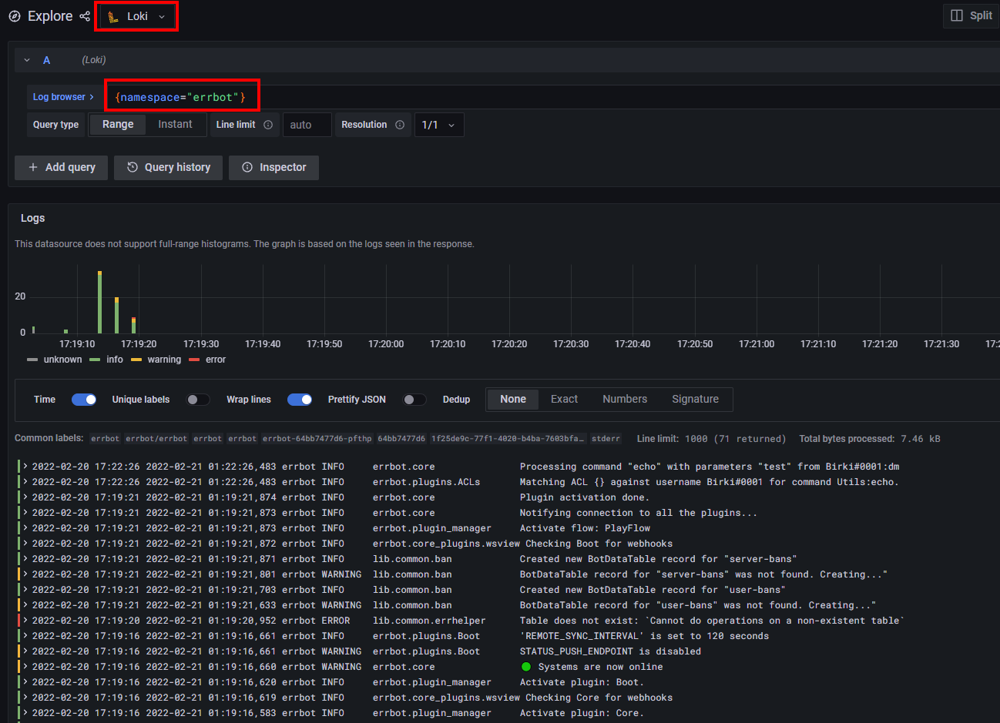

# Skaffold

Running the project with [skaffold](https://skaffold.dev/)

## Prerequisites

Before you can get going with `skaffold` you need to edit one file first to add your bot token

1. Obtain a bot token from your chatservice (Discord, Slack, etc)
2. `base64` encode the token so it can be saved as a k8s secret

    ```console
    $ python3 script/base64string.py --string supersecretvalue
    ```

3. From the root of this repo, edit the following file: `script/k8s/errbot/secret.yaml.example`

    - Add your **base64 encoded** bot token to the file like so: `CHAT_SERVICE_TOKEN: "base64encodedvaluehere=="`
    - Rename the file to `secret.yaml`
    - ⚠️Ensure you don't commit this file as it has your secret token!

## Steps

1. Start your minikube cluster, configure skaffold, and set your Docker context:

    ```console
    $ minikube start --profile custom
    $ skaffold config set --global local-cluster true
    $ eval $(minikube -p custom docker-env)
    ```

2. Start your cluster with skaffold:

    ```console
    $ skaffold dev
    ```

    > Optionally, run `skaffold dev --tail=true` to attach to your running containers to view log output while they run

### Grafana

Now that your cluster is up and running, you can get to your Grafana instance for metrics, logs, etc by doing the following:

1. Open a new terminal window
2. Obtain your Grafana password (the username will be `admin`):

    ```console
    $ kubectl get secret --namespace observability grafana -o jsonpath="{.data.admin-password}" | base64 --decode ; echo
    ```

3. Port forward to your grafana instance:

    ```console
    $ kubectl port-forward --namespace observability service/grafana 3000:80
    ```

    > If your IDE does not automatically direct you, simply go to [http://127.0.0.1:3000/login](http://127.0.0.1:3000/login) after port forwarding with `kubectl`

4. Sign in with the credentials obtained in step two and navigate to the explore tab in Grafana

5. Run a query like the one below to view your `errbot` container logs in real time!

    
